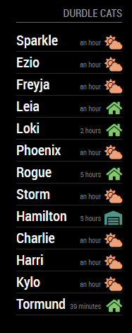

# MMM-DurdleCats
Magic Mirror Module to display Durdle Cats location data

## Note

This only works if you have been granted access to the DurdleCats API.

## Installation

Clone this repository in your modules folder, and install dependencies:

    cd ~/MagicMirror/modules 
    git clone https://github.com/hdurdle/MMM-DurdleCats.git
    cd MMM-DurdleCats
    npm install 

## Configuration

Go to the MagicMirror/config directory and edit the config.js file. Add the module to your modules array in your config.js.

You'll need your DurdleCats API URI, enter this in the config.js for your MagicMirror installation:

        {
            module: "MMM-DurdleCats",
            header: 'Durdle Cats',
            position: "top_right",
            config: {
                apiUri: "https://uri.to.cats.api/",
                refresh: 5,
                exclude: ["Catname","Catname"]
            }
        },

## Module configuration
The module has three items of configuration:

<table>
  <thead>
    <tr>
      <th>Option</th>
      <th>Description</th>
    </tr>
  </thead>
  <tbody>
    <tr>
      <td><code>apiUri</code></td>
      <td>The URI for the DurdleCats API.  <strong>Default: </strong><code>not provided</code></td>
    </tr>
    <tr>
      <td><code>refresh</code></td>
      <td>How often in minutes to refresh the data.  <strong>Default: </strong><code>5</code> </td>
    </tr>
       <tr>
      <td><code>exclude</code></td>
      <td>Array of cat names to exclude from the UI.  <strong>Default: </strong><code>empty</code> </td>
    </tr>
  </tbody>
</table>

